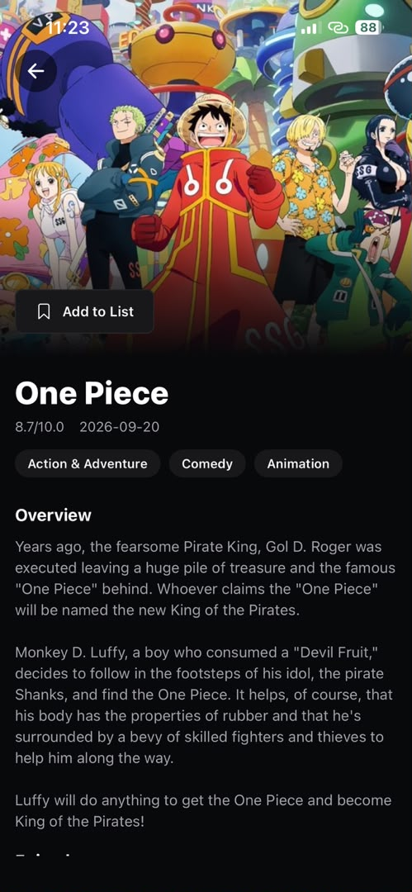
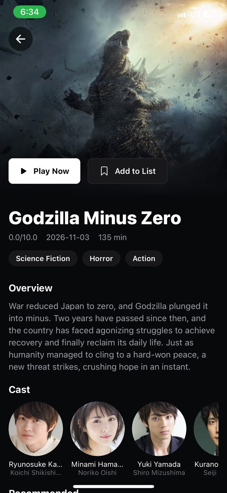
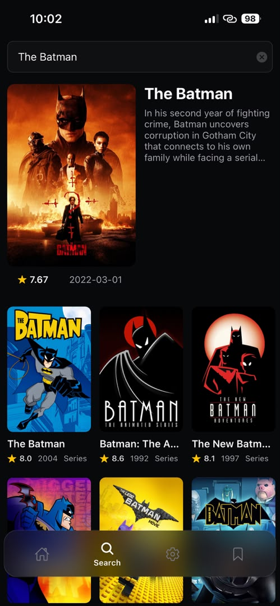
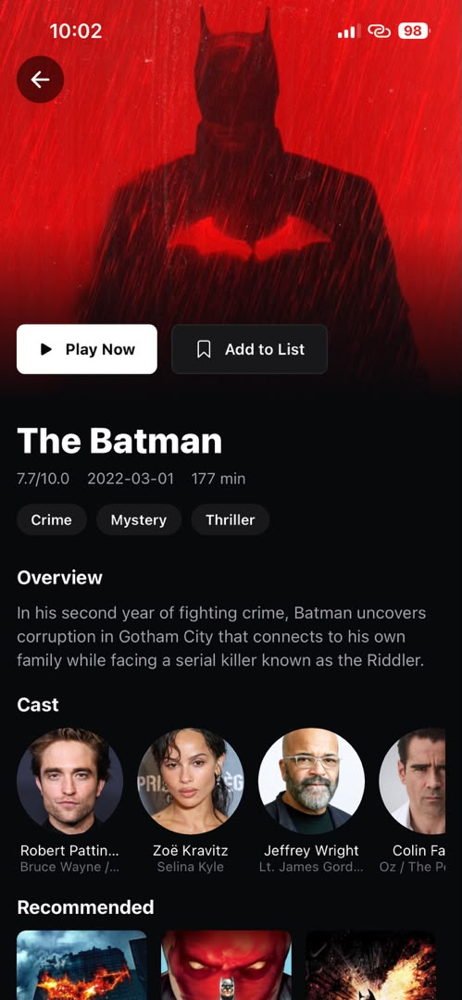

# [Verse]

A mobile app for browsing, searching, and watching movies, TV series, and anime.

## Features

- **Browse & Search** — Search across movies, TV series, and anime, with results showing poster art, title, rating, release year, and content type (movie/series).
- **Title Details** — Dedicated detail screen for each title including:
  - Backdrop artwork with **Play Now** and **Add to List** actions
  - Rating (out of 10), release date, and runtime
  - Genre tags (e.g. Action, Horror, Sci-Fi, Comedy, Animation, Mystery)
  - Full overview / synopsis
  - Cast list with photos, actor names, and character names
  - "Recommended" section for related titles
- **Watchlist** — Save titles to a personal list via **Add to List**.
- **Playback** — Launch playback directly from a title's detail page via **Play Now**.
- **Cross-genre catalog** — Supports live-action films (e.g. _The Batman_, _Godzilla Minus Zero_) and anime/animated series (e.g. _One Piece_).

## Screens

| Screen       | Description                                                           |
| ------------ | --------------------------------------------------------------------- |
| Search       | Search bar with live results grid (posters, ratings, year, type)      |
| Title Detail | Full detail view with hero image, metadata, cast, and recommendations |

## Screenshots

  
  
  
  

## Tech Stack

- Platform: [iOS / Android / React Native / Flutter / etc.]
- Frontend: [React Native]
- Backend / Data source: [TMDB, custom backend]
- State management: [Context API]
